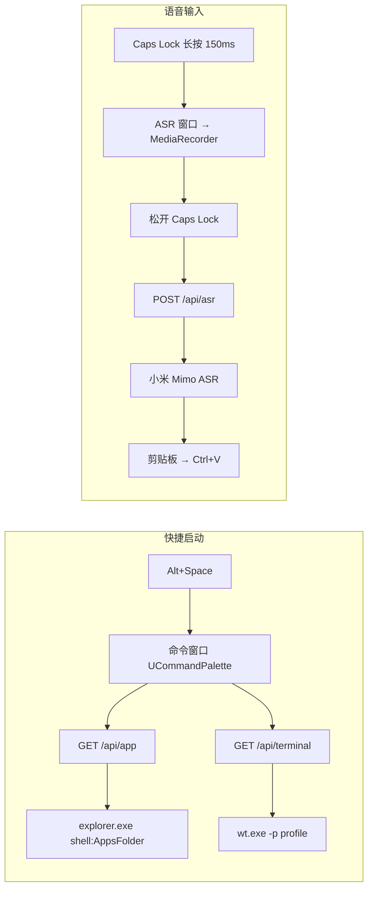

# AGENTS

**Nuxt 4 + Electron** 桌面应用

**技术栈：**

| 层面      | 技术                                                      |
| --------- | --------------------------------------------------------- |
| 前端框架  | Nuxt 4 + Vue 3 + Vue Router 5                             |
| UI 组件   | `@nuxt/ui` v4（基于 Tailwind CSS v4）                     |
| 音频处理  | `@audio/decode` + `@audio/encode`（WebM 解码 → MP3 编码） |
| 桌面壳    | Electron 43                                               |
| 键盘监听  | `uiohook-napi`（全局级，独立于窗口焦点）                  |
| 语音识别  | Web API `MediaRecorder` 录音 → 小米 Mimo ASR API 识别     |
| 拼音搜索  | `pinyin-pro`（支持全拼 / 首字母模糊）                     |
| 持久化    | `conf` npm 包（存储于 `~/.config/aio`）                   |
| 图标集    | Lucide（@iconify-json/lucide）                            |
| HTTP 请求 | `selfFetch`（基于 `$fetch` 的封装，自动错误提示）         |
| 构建打包  | electron-builder，产出 `release/*.zip`                    |
| 版本发布  | GitHub Releases + Scoop manifest (`aio.json`) 自动更新    |

## 开发命令

| 命令               | 作用                              | 备注                                 |
| ------------------ | --------------------------------- | ------------------------------------ |
| `npm run dev`      | 并行启动 Nuxt + Electron 开发模式 | 依赖 `wait-on http://localhost:2999` |
| `npm run build`    | Nuxt 构建 → electron-builder 打包 | 产物输出到 `release/`                |
| `npm run preview`  | 构建后直接启动 Electron（不打包） | 快速验证生产构建                     |
| `npm run release`  | 构建 → 打包 → 发布 GitHub Release | 自动更新 aio.json 并推送             |
| `npm run lint`     | ESLint 检查                       | `@antfu/eslint-config`               |
| `npm run lint:fix` | ESLint 自动修复                   | **唯一格式化命令**，无 Prettier      |
| `npm run ncu`      | 检查依赖更新                      | `npm-check-updates`                  |
| `npm run ncuu`     | 升级所有依赖                      | —                                    |

## 核心功能流程



## 目录结构速览

```text
aio/
├── electron/             # 主进程
│   ├── main.ts           # 入口 — app 生命周期、全局快捷键注册
│   ├── preload.cjs       # contextBridge 暴露 window.electronAPI
│   ├── renderer.ts       # 生产模式下加载 Nuxt 服务端入口
│   ├── tray.ts           # 系统托盘 — 窗口管理菜单 + 退出
│   ├── windows.ts        # 窗口工厂 — createWindow / toggleWindow / toggleDevTools
│   ├── asr/
│   │   ├── index.ts      # 语音识别主逻辑 — Caps Lock 长按监听、IPC 通信、结果回写剪贴板
│   │   └── window.ts     # ASR 窗口创建（隐藏，仅含 preload）
│   └── command/
│       └── window.ts     # 命令窗口创建（无边框、不显示任务栏）
├── app/                  # 前端（Nuxt 渲染进程）
│   ├── app.vue           # 根组件 — <UApp> 包裹 <NuxtPage>
│   ├── electron.d.ts     # window.electronAPI 类型声明
│   ├── pages/
│   │   ├── index.vue     # 首页（默认 NuxtWelcome）
│   │   ├── command/      # 命令面板页面
│   │   └── asr/          # 语音识别页面（状态展示）
│   ├── composables/
│   │   ├── useCommand.ts # 命令面板数据 — apps / terminals 两组 + 拼音搜索
│   │   └── useAsr.ts     # 语音识别 — MediaRecorder 录音 → WebM 解码 → MP3 编码 → Base64 → API
│   ├── utils/
│   │   ├── selfFetch.ts      # $fetch 封装（自动错误 Toast）
│   │   └── useSelfFetch.ts   # useFetch 封装（基于 selfFetch）
│   └── assets/css/
│       └── main.css      # Tailwind v4 + @nuxt/ui 入口
├── server/               # Nitro 服务端
│   ├── api/
│   │   ├── app/          # GET 获取应用列表 / GET 打开应用
│   │   ├── terminal/     # GET 获取终端列表 / GET 打开终端
│   │   ├── asr/          # POST 语音识别（小米 Mimo）
│   │   └── conf/         # GET 读取配置项
│   └── utils/
│       ├── conf.ts       # conf 实例（schema 定义，存储于 ~/.config/aio）
│       └── terminal.ts   # Windows Terminal 读取（settings.json 解析、wt.exe 定位）
├── shared/types/         # 共享 TS 类型
│   ├── application.ts    # Application { name, id }
│   └── conf.ts           # AppConf / AsrConf
└── public/               # 静态资源（favicon.ico 用于托盘图标）
```

## Nuxt 4 约定

- **自动导入**：代码中未显式 `import` 的 Vue / Nuxt API、`@nuxt/ui` 组件以及 `server/utils/` 下的导出，均依赖 Nuxt 4 自动导入机制
- **文件即路由**：`app/pages/` 下的 Vue 文件自动映射为前端页面路由；`server/api/` 下的文件映射为后端 API 路由

## 关键约定

### 格式化与样式

- **格式**：仅 ESLint（`eslint-plugin-format`），无 Prettier
- **CSS**：Tailwind v4 + `@nuxt/ui`，通过 `class` / `ui` 属性
- **VSCode**：`.vscode/settings.json` 已配置保存时 ESLint 自动修复、Prettier 禁用、Tailwind CSS 关联

### Electron IPC

| Channel      | 方向              | 触发时机             | 数据内容        |
| ------------ | ----------------- | -------------------- | --------------- |
| `asr-start`  | 主进程 → 渲染进程 | Caps Lock 长按 150ms | `"开始"` 字符串 |
| `asr-end`    | 主进程 → 渲染进程 | Caps Lock 松开       | 无              |
| `asr-result` | 渲染进程 → 主进程 | 语音识别完成         | 识别结果文本    |

Preload：`electron/preload.cjs`，`contextBridge` 暴露 `window.electronAPI`。

- `onStart(cb)` / `onEnd(cb)` 返回取消监听的清理函数
- `sendResult(data)` 发送识别结果

### 窗口管理

所有窗口通过 `electron/windows.ts` 的 `createWindow(name, url, options)` 统一创建，自动去重（同名窗口存在时聚焦而非新建）。窗口关闭时自动从 `windows` Map 移除并更新托盘菜单。

| 窗口名    | 路由       | 特性                             |
| --------- | ---------- | -------------------------------- |
| `command` | `/command` | 无边框、不在任务栏显示、失焦隐藏 |
| `asr`     | `/asr`     | 隐藏窗口、始终后台、加载 preload |

### 系统托盘

`electron/tray.ts` 使用 `public/favicon.ico` 作为图标，右键菜单列出所有活跃窗口的显示/隐藏/关闭操作，以及退出应用选项。

### 快捷键

| 快捷键           | 作用          | 实现                          |
| ---------------- | ------------- | ----------------------------- |
| `Alt+Space`      | 切换命令面板  | `globalShortcut.register`     |
| `Ctrl+Shift+D`   | 打开 DevTools | `globalShortcut.register`     |
| `Caps Lock 长按` | 语音输入      | `uiohook-napi` 150ms 长按检测 |

### 语音识别链路

1. `uiohook-napi` → Caps Lock 长按 150ms → IPC `asr-start`
2. ASR 页面 `useSpeechRecognition()` 启动 MediaRecorder 录音
3. 松开 Caps Lock → 立即模拟一次 Caps Lock 按键，将因长按改变的大小写状态恢复原状 → IPC `asr-end` → 停止录音
4. WebM Blob → `@audio/decode` 解码 → `@audio/encode` 编码为 MP3 → Base64（`useBase64`）→ `POST /api/asr` → 小米 Mimo ASR API
5. 主进程收到结果 → 剪贴板写入 → 模拟 Ctrl+V 粘贴（5s 超时丢弃）

### 命令面板

- `<UCommandPalette>` + `useCommand` 组合函数
- 两组数据：**Terminals**（Windows Terminal 配置文件列表）和 **Applications**（系统开始菜单应用）
- 应用名通过 `pinyin-pro` 生成全拼/首字母作为 Fuse.js 搜索关键字
- 选中后通过 `selfFetch` 调用对应 API 启动
- 搜索配置：`matchAllWhenSearchEmpty: false`，搜索 `label`、`suffix`、`keywords` 字段
- `@keydown.space.prevent` 阻止空格触发选中
- 选中后自动重置面板（`resetPalette`）

### HTTP 请求封装

- **`selfFetch`**（`app/utils/selfFetch.ts`）：基于 `$fetch.create()`，自动处理 `onResponseError`，通过 `useToast()` 显示错误提示
- **`useSelfFetch`**（`app/utils/useSelfFetch.ts`）：基于 `createUseFetch`，将 `useFetch` 的底层 `$fetch` 替换为 `selfFetch`，使所有 `useFetch` 调用自动享有错误处理

### 配置系统

- **存储**：`conf` 包，数据目录 `~/.config/aio`
- **Schema**：定义于 `server/utils/conf.ts`，当前仅有 `asr.key`（小米 Mimo API Key）
- **API**：`GET /api/conf?name=asr` 读取配置（`server/api/conf/index.get.ts`）
- **自动导入**：`server/utils/conf.ts` 的 `default export`（`conf` 实例）在 `server/api/` 下自动可用

### 构建与打包

- `electron-builder.yml` 配置：输出到 `release/`，仅 `zip`，包含 `.output/`、`electron/`、`public/`
- `.gitignore` 忽略：`.output`、`.nuxt`、`.data`、`.nitro`、`.cache`、`dist`、`node_modules`、`release/`
- 无 `typecheck` 脚本，tsconfig 引用 `.nuxt/` 下自动生成的四个 tsconfig 文件
- `package.json` 的 `allowScripts` 已授权 `uiohook-napi`、`esbuild`、`electron-winstaller` 等原生模块编译

### 发布流程

`npm run release` → `release.ts` 执行以下步骤：

1. 按时间戳生成版本号（`YYYYMMDDHHmmss`）
2. 计算 `release/Aio-win-x64.zip` 的 SHA256
3. 更新 `aio.json` 的 `version` 和 `hash`
4. `git commit` + `git push` 推送 scoop manifest
5. 删除旧 `latest` tag/release → 创建新 tag → `gh release create` 上传 zip

`aio.json` 为 Scoop 包管理器的 manifest 文件，指向 GitHub Release 的下载地址。
